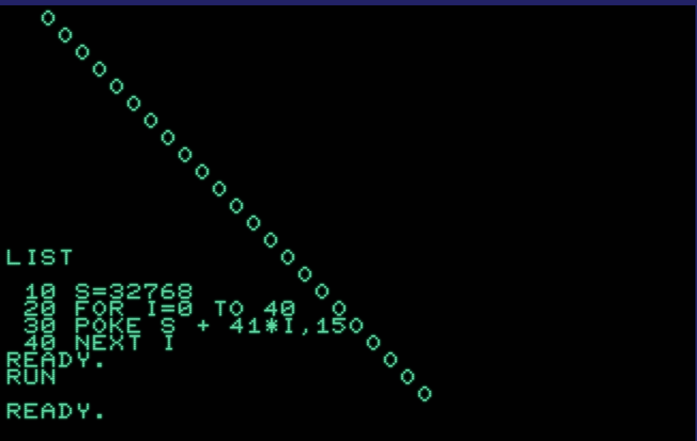
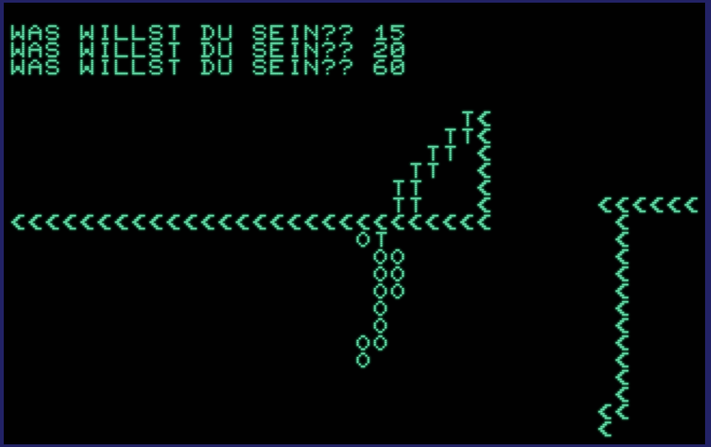
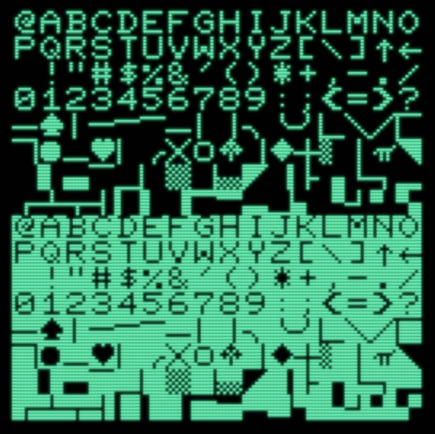

<!-- lang:de_DE -->

# Praktikumsbericht Pauline Lincke HPI September/Oktober 2019

# CBM2001

## 1. Einfache Programme

``` 
print "hello"
hello
```

- führt eine Anweisung einfach aus

``` 
10 print "hello"
run
hello
run
hello
```

- Anweisung ist an Zeile gebunden
- Es kann eine beliebige Zeilennummerierung gewählt werden
- die Zeilen werden von 1 aufsteigend abgespielt
- Die Zeilen müssen nicht Direkt aufeinander folgend sein
- Eine Nummerierung mit nicht direkt aufeinander folgenden Zahlen ist vorteilhaft, da man so noch Platz für Einschübe in das Programm hat
- `run` lässt Programm abspielen

``` 
10 print "hello"
20 go to 10 
```

- Programmabschnitt wiederholt sich immer wieder von Zeile 10 bis 20
- schreibt immer wieder "hello" bis man das Programm unterbricht

``` 
list
```

- zeigt alle Programme (an Zeilen gebundene Anweisungen) an

``` 
10 i=0
20 print i
30 i=i+1
40 go to 20
```

- Mit diesen Befehlen zählt der Computer von 0 in einer-Schritten aufwärts, bis man ihn stoppt
- 0 ist der Startpunkt
- `i=i+1` gibt an, dass das Programm in Einer-Schritten zählen
- `go to 20` lässt das Programm sich immer wieder wiederholen

## 2. Speichern

``` 
save 
```

- speichert das gesamte Programm auf einer Kassette, falls eine solche angeschlossen ist
- man muss play und reccord auf dem kassettenlesegerät gedrückt halten, bis auf dem Computer `waiting` zu lesen ist
- Speichert man ein Programm auf einer Kassette kann man es durch `load` wieder laden, falls es durch ausstellen des Computers,oder ähnliches, gelöscht wurde
- dies kann eine Weile dauern

## 3. Drucken

``` 
10 Open 5,4,0
20 For k = 1 to 50
30 Print#5,k
40 next k
50 close 5
```

- öffnet den Drucker im normalen Druckmodus
- druckt die Zahlen 1 bis 50
- Damit das funktioniert, muss man einen Drucker anschließen, welcher funktionstüchtig ist und ein Blatt Papier einlegen
- schreibt man die "k's" in Großbuchstaben funktioniert es nicht #interessant

## 4. Bedingungen

``` 
10 i=1
20 print i
30 i=i+1
40 if i <51 then 20
```

- zählt von 1 bis 50
- Verschiedenste Möglichkeiten mit dem selben Ergebnis
- Quasi das gleiche wie beim Drucken-Programm nur ohne Drucken
- hiermit kann man festlegen, wann eine Schleife enden soll und was dann getan werden soll

## 5. Benutzerdefinierte Bedingungen

``` 
10 input "Wieviel?";N
20 input "Wie schnell?";J
30 I=0

40 Print I
50 I=I+J
60 If <N then 40
```

- Hiermit kann man den Benutzer des Programms fragen, welche Variablen er nutzen möchte
- dies ist mit nur einer, aber auch mit mehreren Variablen möglich
- Die Fragen müssen am Anfang des Programmabschnitts sein, da sonst mitten im Programm, aufgrund der Schleife, wieder danach gefragt wird

## 6. Mit Zeichen malen
```
POKE 32956,61
```
* zeichnet `=` in den Oberen rechten Teil des Bildschirms
```
10 for i= 1 to 256
20 poke i + 32768,i
30 next i
```
* Dies zeigt alle verfügbaren Zeichen auf
* Die Zeichen werden von oben links nebeneinander aufgelistet und belegen ca. 3,5 Zeilen
* 32768 legt den Startpunkt auf dem Bildschirm fest und kann in jede beliebige, auf dem Bildschirm vorhandene (32768-33767) geändert werden

{height=250}

```
10 GET G$
20 IF G$="" THEN 10
30 PRINT G$
40 GOTO 10
```

## 7. The walking O

```
10 P = 32768
11 CX = 20
12 CY = 20
20 GET G$
30 IF G$ = "W" THEN CX = CX -1
40 IF G$ = "A" THEN CY = CY - 1
50 IF G$ = "S" THEN CX = CX + 1
60 IF G$ = "D" THEN CY = CY +1
90 PRINT CHR$ (147)
110 POKE P+40* CX +CY,15
120 GOTO 20
```
* laufendes O, dass mit wasd bewegt werden kann
* läuft jeweils einen Schritt in die angegebene Richtung

## 8. painting with numbers

{height=250}
```
10 P = 32768
11 CX = 20
12 CY = 20
19 PRINT CHR$ (147)
20 GET G$
30 IF G$ = "W" THEN CX = CX -1
40 IF G$ = "A" THEN CY = CY - 1
50 IF G$ = "S" THEN CX = CX + 1
60 IF G$ = "D" THEN CY = CY +1
70 IF G$ = "C" THEN 200
110 POKE P+40* CX +CY,I
130 GO TO 20
200 INPUT "WAS WILLST DU SEIN?";I
210 GO TO 20
```
* mit diesem Programmabschnitt kann man mit den Tasten WASD sozusagen malen
* durch Eingabe von `C` wird man gefragt was man sein will 
* Jedes Zeichen hat eine zugehörige Nummer, welche man eintippen muss, damit der Charakter zu diesem wechselt
* Der bereits gefahrene Weg wird nicht, wie beim Vorherigen Programmabschnitt, sofort wieder gelöscht
 tippen
* Ein Problem ist, dass die Frage "Was willst du sein?" jedes mal stehen bleibt, wodurch der Bildschirm nicht 100% frei ist
* im gegensatz zum vorherigen "mit Zeichen malen" kann man bei diesem die Richtung angeben, in welche gezeichnet werden soll und kann 
## 9. The painting snake
```
10 P = 32768
11 X = 20.0
12 Y = 20.0
13 XV = 0.0
14 YV = 0.0
19 PRINT CHR$ (147)
20 GET G$
30 IF G$ <>"W" THEN 40
31 XV= 0
32 YV = 0.1
40 IF G$ <> "A" THEN 50
41 XV = -0.1
42 YV = 0
50 IF G$ <> "S" THEN 60
51 XV = 0
52 YV = -0.1
60 IF G$ <> "D" THEN 70
61 XV = 0.1
62 YV = 0
70 IF G$ = "C" THEN 200
80 X = X + XV
81 Y = Y + YV
82 A=(40 * INT(Y))+INT(X)
85 GOTO 120
90 PRINT "X" X "Y" Y "XV" XV "YV" YV "A" A
95 GOTO 20
120 POKE P+INT(A),I
130 GO TO 20
200 INPUT "WAS WILLST DU SEIN?";I
210 GO TO 20
```
* Zeile 85 bis 95 sind ein Werkzeug zum Debuggen, welches normalerweise übersprungen wird
* der unterschied von diesem Programm zum vorherigen ist, dass der Charakter sich nun von selbst bewegt und man nicht mehr für jedes Zeichen eine Taste drücken muss, sondern nur noch wenn man die Richtung ändern möchte.
* wir haben festgestellt, dass man Dinge nur mit Zeichenkombinationen mit maximal 2 Zeichen benennen kann. 
* A ist der Punkt auf dem Bildschirm auf dem man sich befindet
* X und Y sind die Koordinaten nach oben, unten, links und rechts, wie in einem Koordinatensystem

## 10. Zeichensatz
{height=250}
```
5 PRINT CHR$(147)
10 FOR I=0 TO 15
20 FOR K=0 TO 15
30 POKE 32768 + (I+4)*40 + K+4 ,I*16+K
40 NEXT K
50 NEXT I
```
* Das sind alle möglichen Zeichen


